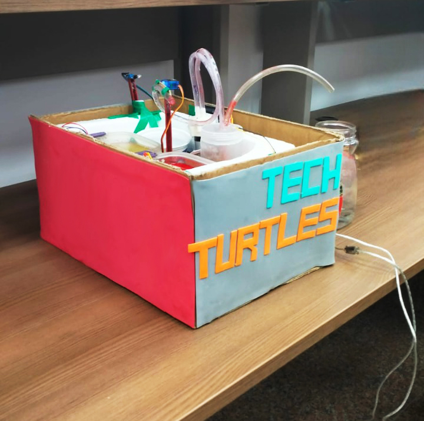

# ADVIA 1800 Prototype

## Team: Tech Turtles

### Team Members:
- [Ziyad El-Fayoumy](https://github.com/Zoz-HF)
- [Amagd Atef](https://github.com/amg-eng)
- [Mahmoud Mohamed](https://github.com/Mahmoudm007)
- [Ahmed Kamal](https://github.com/AhmedKamalMohammedElSayed)
- [Abdelrahman Shawky](https://github.com/AbdulrahmanGhitani)
- [OmarAbdelnasser](https://github.com/omarshaban02)
- [Camellia Marwan](https://github.com/camelliamarwan)

## Project Overview:

This project involves the development of a prototype for the ADVIA 1800, a crucial piece of medical equipment used for high-throughput clinical chemistry analysis. The prototype is designed and built as part of the Medical Equipment 2 course, under the supervision of Dr. Eman Ayman, in collaboration with Siemens Healthineers.

### Key Features of Our ADVIA 1800 Prototype:
1. **Acquisition Pump**: Ensures precise sampling.
2. **Mixer**: Efficiently combines samples and reagents.
3. **Light Source & Light Detector**: Utilizes a 650 nm laser and a Light Dependent Resistor (LDR) for accurate photometric measurements.
4. **Servo Motors**: Provides precise movement for sample handling.
5. **IR Sensor & Level Detector**: Enhances reliability with accurate obstacle and liquid level detection.
6. **Result Display System**: LCD to display detected concentrations.

## Setup and Dependencies:
- **Arduino Libraries**:
  - Servo.h
  - LiquidCrystal_I2C.h
  
## Installation and Configuration:
1. **Arduino Setup**:
   - Ensure that you have the Arduino IDE installed on your system.
   - Include the necessary libraries in your Arduino project: `Servo.h` and `LiquidCrystal_I2C.h`.
   
2. **Hardware Setup**:
   - Connect the necessary components according to the pin connections defined in the code:
     - LDR sensor, laser, relays, servo motors, etc.
   - Verify that the connections match those specified in the code.
   
## Usage:
1. **Upload Code**:
   - Upload the provided Arduino code to your Arduino board.
   
2. **Serial Monitor**:
   - Open the Arduino Serial Monitor to monitor sensor readings and system operations.
   
3. **Functionality**:
   - The prototype performs the following operations:
     - Sampling, mixing, and photometric measurements.
     - Calculation of concentrations based on absorbance.
     - Display of concentration results on an LCD screen.

## Troubleshooting:
- If you encounter any errors or issues during setup or usage, refer to the provided error codes and check the hardware connections.
- Ensure that the sensors are calibrated and functioning correctly.

## Acknowledgments:
- We extend our gratitude to Dr. Eman Ayman for her guidance and support throughout this project.
- Special thanks to Siemens Healthineers for their supervision of our project.
